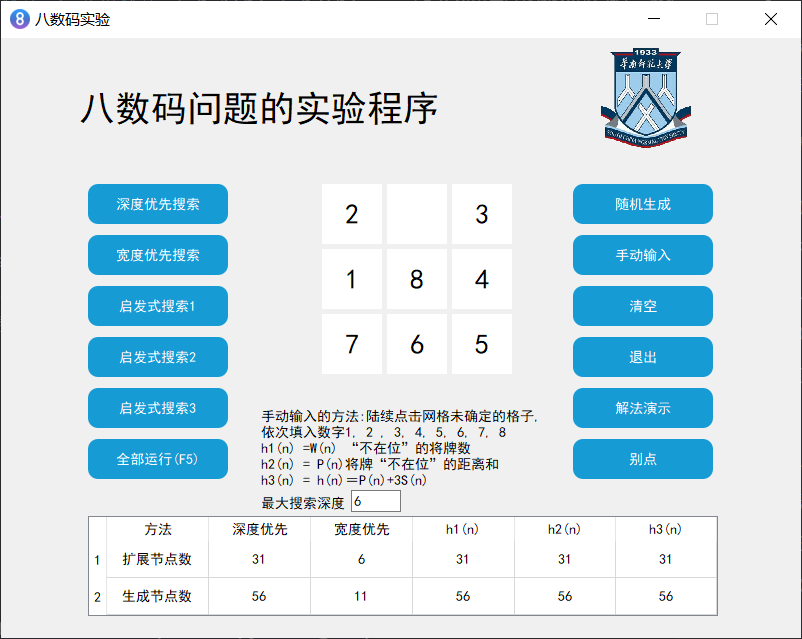
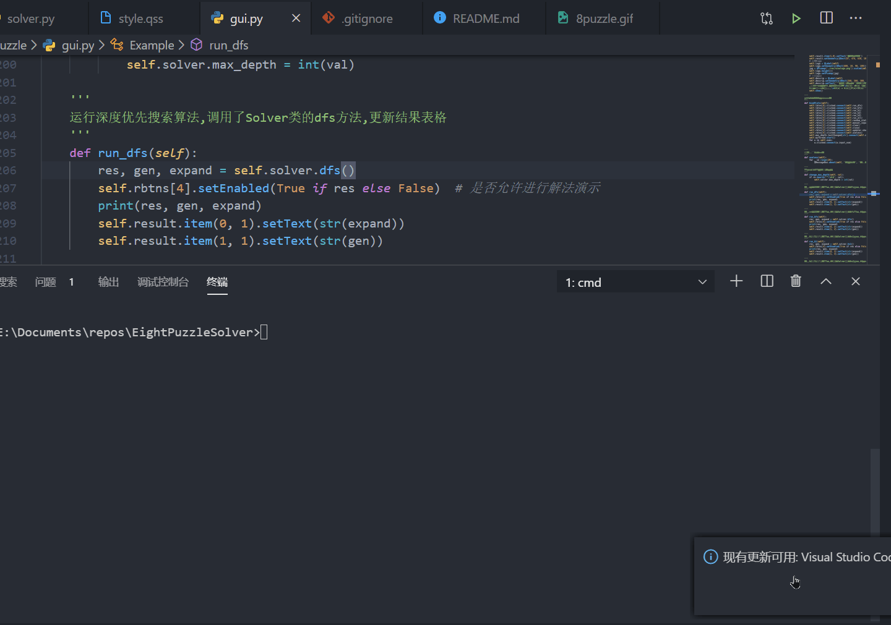

# EightPuzzleSolver
 python3.7使用A*算法采用不同的h(n)实现八数码问题，输出包括拓展结点数和生成结点数。
- 深度优先搜索(depth-first-search)
1.  G:=G0(G0=s), OPEN:=(s), CLOSED:=( ); 
2.  LOOP:    IF OPEN=( ) THEN EXIT (FAIL); 
3.  n:   =LAST(OPEN); 
4.  IF GOAL(n) THEN EXIT (SUCCESS); 
5.  REMOVE(n, OPEN), APPEND(n, CLOSED); 
6.  IF DEPTH(n)≥Dm GO LOOP; 
7.  EXPAND(n) →{mi}, G:   =ADD(mi, G); 
8.  IF 目标在{mi}中 THEN EXIT(SUCCESS); 
9.  APPEND(mj, OPEN), 并标记mj到n的指针; 
10. GO LOOP; 

- 宽度优先搜索(breadth-first-search)
1.  G:=G0(G0=s), OPEN:=(s), CLOSED:=( ); 
2.  LOOP:    IF OPEN=( ) THEN EXIT (FAIL); 
3.  n:   =FIRST(OPEN); 
4.  IF GOAL(n) THEN EXIT (SUCCESS); 
5.  REMOVE(n, OPEN), APPEND(n, CLOSED); 
6.  IF DEPTH(n)≥Dm GO LOOP; 
7.  EXPAND(n) →{mi}, G:   =ADD(mi, G); 
8.  IF 目标在{mi}中 THEN EXIT(SUCCESS); 
9.  APPEND(mj, OPEN), 并标记mj到n的指针; 
10.  GO LOOP; 

+ 启发式搜索算法
1. OPEN: =(s), f(s): =g(s)+h(s);
2. LOOP: IF OPEN=( ) THEN EXIT(FAIL);
3. n: =FIRST(OPEN);
4. IF GOAL(n) THEN EXIT(SUCCESS);
5. REMOVE(n, OPEN), ADD(n, CLOSED);
6. EXPAND(n) →{mi},
7. ADD(mj, OPEN), 标记mj到n的指针;
8. IF f(n, mk)< f(mk) THEN f(mk): =f(n, mk),标记mk到n的指针;
9. IF f(n, ml)< f(ml) THEN f(ml): =f(n, ml), 标记ml到n的指针, ADD(ml, OPEN);
7. OPEN中的节点按f值从小到大排序;
8. GO LOOP; 

计算f(n, mi): =g(n, mi)+h(mi); 

  （h1(n) =W(n) “不在位”的将牌数）
  （h2(n) = P(n)将牌“不在位”的距离和）
  （h3(n) = h(n)＝P(n)+3S(n)） 

S(n)是对节点n中将牌排列顺序的计分值,
规定对非中心位置的将牌, 顺某一方向检查, 若某一将
牌后面跟的后继者和目标状态相应将牌的顺序相比不一
致时, 则该将牌估分取2, 一致时则估分取0; 对中心位置
有将牌时估分取1, 无将牌时估分值取0; 所有非中心位置
每个将牌估分总和加上中心位置的估分值定义为S(n)。

手动输入状态的流程描述:
1. 点击手动输入按钮
2. 九宫格清空,设置为可点击, 禁用搜索和演示功能, cnt=1
3. 点击空白格子,填入一个数字cnt,然后设置为不可点击, cnt+=1
4. 陆续点击8次,将数字1到8依次填入
5. 当填完8个格子,手动输入完毕,允许搜索

| 方法      | 深度优先 | 宽度优先 | h_1(n) | h2(n) | h3(n) |
| -------------- | ------------ | ------------ | ------ | ----------------- | ----------------- |
| 扩展结点数 |              |              |        |                   |                   |
| 生成结点数 |              |              |        |                   |                   |

gui原型图

## 运行方法

1. 已安装pyQt5,如果没有安装,使用pip命令安装:`pip install pyQt5`

2. 切换到项目文件夹puzzle, 命令行输入`python gui.py`

    

## 踩坑记录
qt主线程会维持一个信息循环,持续监听事件,如果在主线程里调用sleep之类的函数阻塞主线程就会导致程序无响应,因此如果有必要等待一段时间执行某操作,就需要将这些操作放在子线程中运行
在子线程中对控件setEnabled(False), 会导致程序未响应.原因不明
