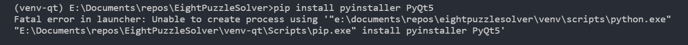
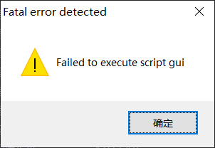
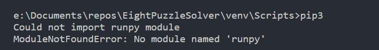

# 打包pyqt程序
一行命令:`pyinstaller puzzle\gui.py -Fw -i puzzle\res\8puzzle.ico`
## 需要环境
OS: win10 64bit
Python Interpreter: python 3.6以上
## 操作流程
打包过程需要用pip安装一些包,如果已经安装,则可跳过安装命令
1. virtualenv是一个创建python虚拟环境的工具,使用目的是构建一个最小的打包环境, conda也可以创建虚拟环境, 但是会安装过多的与数据分析, 科学计算相关的依赖, 而安装虚拟环境的目的正是为了减少与项目无关的包,是否使用conda根据你项目内容来定.virtualenv安装命令`pip install virtualenv`

2. 在当前目录创建虚拟环境 `virtualenv --no-site-packages venv-qt`. `--no-site-packages`参数很重要,不加该参数时会拷贝系统的已有的site-package目录下的包,这违背了构建最小打包环境的初衷.创建好虚拟环境后会生成`venv-qt`文件夹,里面包含了python解释器和pip之类的基本工具和一些基本的包, `venv-qt`可以修改成你喜欢的名字, 但输入命令之后不能再重命名了,否则会出现找不到路径的问题.

    比如说我一开始运行了`virtualenv --no-site-packages venv`而后把`venv`重命名成`venv-qt`,但程序依旧只认为未重命名前的路径

    

    这是因为它使用了绝对路径并且把路径写死了,仅仅修改activate.bat的VIRTUAL_ENV的值是没用的,暂时没找到好的方法

3. 激活虚拟环境 `venv-qt\Scripts\activate`.这时候输入python时使用的就是虚拟环境中的python了

4. 确保虚拟环境激活后,安装PyQt5和pyinstaller `pip install PyQt5 pyinstaller`.前者是构建qt界面所必须,后者是打生成可执行程序所必须

5. 假设主程序文件是`gui.py`,调用`python gui.py`确保可运行, 之后开始打包`pyinstaller -w gui.py  -i your.icon` 

    `-w`表示生成窗体程序,无命令行界面

    `-i`表示设置可执行程序的图标,这个跟在代码里设置的setWindowIcon方法不同, 没有加-i,打包出来的可执行程序的图标是一个很丑的默认图标

    加`-F`参数不会生成依赖项,只有一个exe程序,但是可能启动比较慢,并且不确定是否可移植到没有装过qt的电脑上运行

6. 如果你的gui程序引用了外部的资源文件,需要检查路径.一般需要把资源文件放到可执行程序的同级目录下,这与你在程序里写的路径有关(写了绝对路径就当我没说),exe程序和资源文件的相对关系不正确时有一下报错:

另外,尽管有了虚拟环境,但我把环境之外的python相关的东西删了(比如卸载Anaconda),我虚拟环境里的脚本也用不了了, 提示如下:
